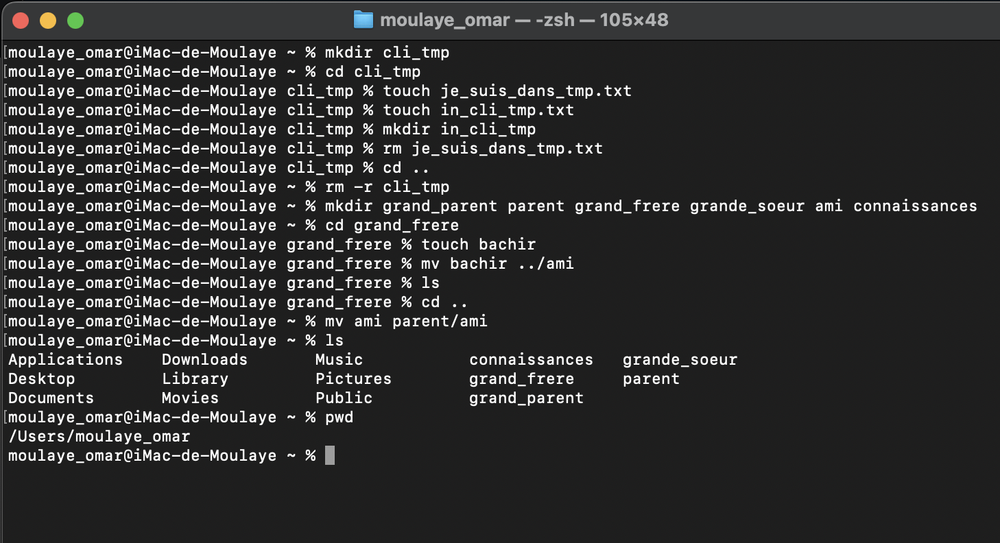

 Exercice 1
- mkdir cli_tmp
- touch je_suis_dans_tmp.txt
- cd cli_tmp
   touch in_cli_tmp.txt
   mkdir in_cli_tmp
- rm je_suis_dans_tmp.txt
- cd ..
  rm -r cli_tmp
- mkdir grand_parent parent grand_frere grande_soeur ami connaissances
- cd grand_frere
  touch bachir 
  mv bachir ../ami
- cd ..
  mv ami parent/ami
- pwd

