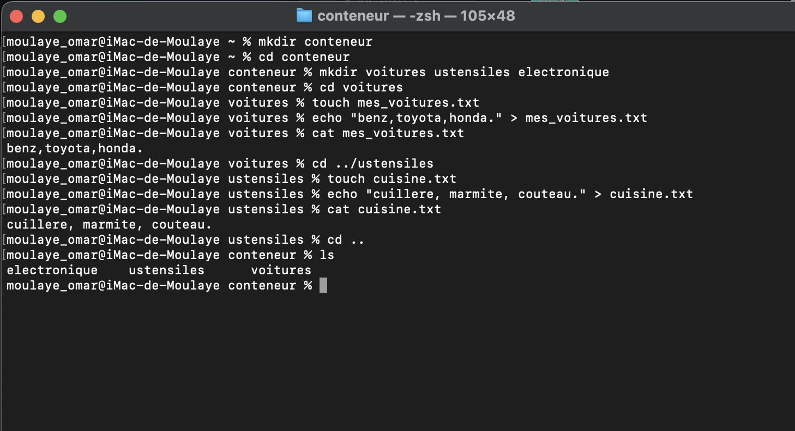

  Exercice 2
- cd ~
- mkdir conteneur
- cd conteneur
  mkdir voitures ustensiles electronique
- cd voiture
  touch mes_voitures.txt
  echo "benz, toyota, honda.
- cd ../ustensiles
  touch cuisine.txt
  echo "cuillere, marmite, couteau."
- cat cuisine.txt
- cd ..
  ls 

