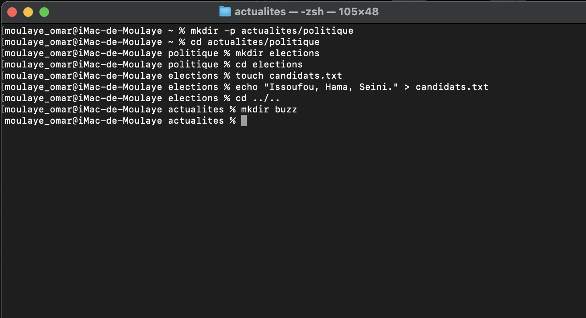

  Exercice 3
- cd ~
- mkdir -p actualites/politique
- cd politique
    mkdir elections
    cd elections
    touch candidats.txt
- echo "Issoufou, Hama, Seini." > candidats.txt
- cd ../..
- mkdir buzz

