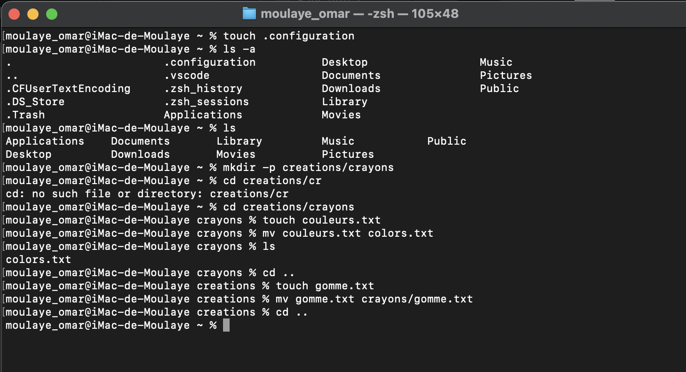

  Exercice 4
- cd ~
- mkdir .configuration
- ls -a
- mkdir -p creations/crayons
- cd creations/crayons
  touch couleurs.txt
- mv couleurs.txt colors.txt
- cd ..
  touch gomme.txt
  mv gomme.txt ../crayons
- cd ~
  

