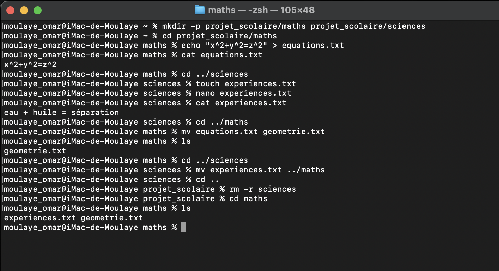

  Exercice 5
- cd ~
- mkdir projet_scolaire/maths projet_scolaire/sciences 
- cd maths
  touch equations.txt
  echo "x^2 + y^2 = z^2" > equations.txt
- cd ../sciences
  touch experiences.txt
  echo "eau + huile = séparation" > experiences.txt
- cd ../maths
  mv equations.txt geometrie.txt
- cd ../sciences
  mv experiences.txt ../maths
- cd ..
  rm -r sciences
  

