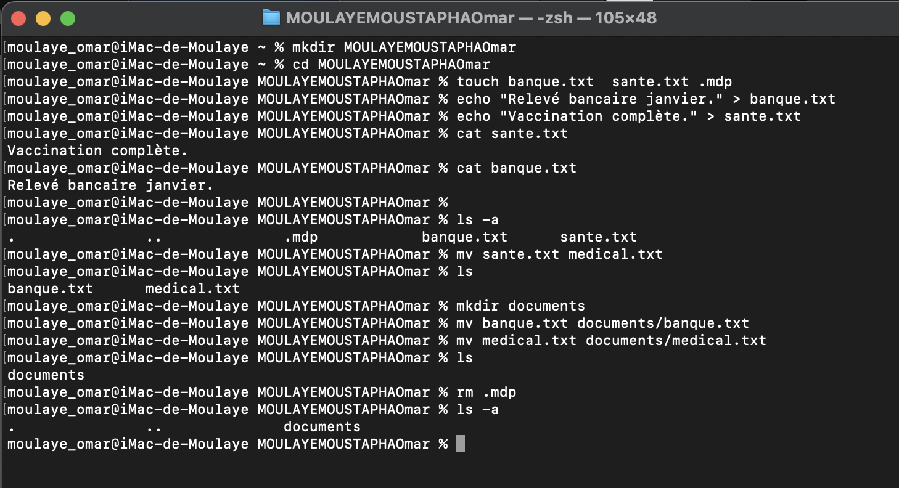

  Exercice 6
- cd ~
- mkdir MOULAYEMOUSTAPHAOmar
  cd MOULAYEMOUSTAPHAOmar
- touch banque.txt sante.txt .mdp
- echo "Relevé bancaire janvier." > banque.txt
- echo "Vaccination complète." > sante.txt
- ls -a
- mv sante.txt medical.txt
- mkdir documents
  mv medical.txt documents/medical.txt
  mv banque.txt documents/banque.txt
- mv -r .mdp

